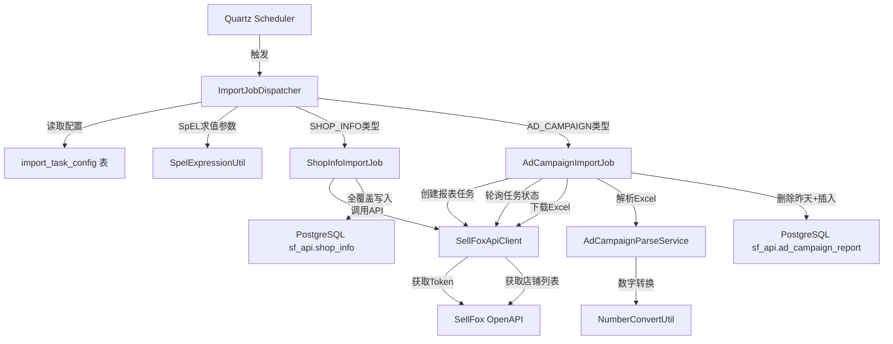
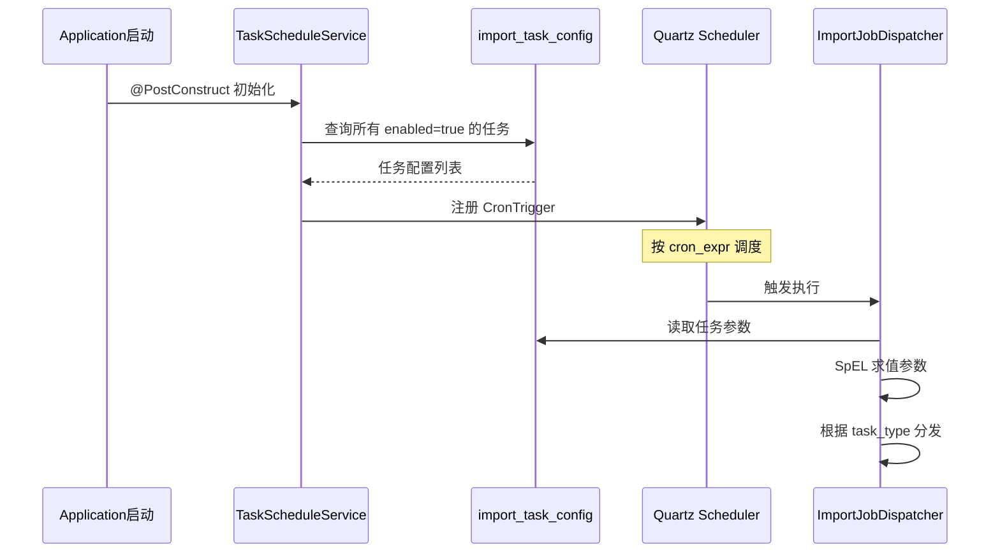

# SellFox API 数据导入服务开发计划

## 1. 概述

将现有 `backend/sf-api` 独立项目的功能整合到 `hof-wms` 主后端的 `integration-service` 模块中，实现 ShopInfo 和广告活动数据的定时自动导入。

### 核心需求
1. **ShopInfo 导入** — 全覆盖模式（TRUNCATE + INSERT）
2. **广告活动数据导入** — 导入最近2天数据，删除昨天数据，数字字段转换
3. **可配置调度** — Cron 表达式配置频率和时间
4. **参数表达式支持** — 任务参数支持 SpEL 表达式动态求值
5. **定时任务框架** — 使用 Quartz（已在 sf-api 中引入）

### 技术选型
| 组件 | 选择 | 理由 |
|------|------|------|
| 定时任务框架 | **Quartz**（内存模式） | 流行开源框架，Spring Boot 原生集成，支持动态 Cron，使用 RAM JobStore |
| HTTP 客户端 | OkHttp 4.12 | sf-api 已使用，成熟稳定 |
| Excel 解析 | Apache POI 5.2.5 | sf-api 已使用 |
| 表达式引擎 | Spring SpEL | sf-api 已使用，Spring 原生 |
| 数据库访问 | Spring JDBC Template | 轻量，适合批量操作 |

## 2. 架构设计



## 3. 模块结构

在 `integration-service` 中新增 sf-api 相关包：

```
backend/services/integration-service/src/main/java/com/hof/wms/integration/
├── controller/
│   └── SyncController.java          (已有)
│   └── SfImportController.java      (新增 - 手动触发/查看状态)
├── config/
│   └── QuartzConfig.java            (新增 - Quartz配置)
│   └── SellFoxConfig.java           (新增 - SellFox API配置)
├── job/
│   └── ImportJobDispatcher.java     (新增 - Quartz Job分发器)
│   └── ShopInfoImportJob.java       (新增 - 店铺导入Job)
│   └── AdCampaignImportJob.java     (新增 - 广告活动导入Job)
├── client/
│   └── SellFoxApiClient.java        (新增 - 迁移自sf-api)
├── model/
│   └── ShopInfo.java                (新增 - 迁移自sf-api)
│   └── ApiResponse.java             (新增)
│   └── AccessTokenResponse.java     (新增)
│   └── ShopListResponse.java        (新增)
│   └── CreateTaskRequest.java       (新增)
│   └── CreateTaskResponse.java      (新增)
│   └── TaskInfo.java                (新增)
│   └── TaskListResponse.java        (新增)
│   └── TaskQueryRequest.java        (新增)
├── entity/
│   └── ImportTaskConfig.java        (新增 - 任务配置实体)
│   └── AdCampaignReport.java        (新增 - 广告报告实体)
├── service/
│   └── SfImportService.java         (新增 - 导入业务逻辑)
│   └── AdCampaignParseService.java  (新增 - Excel解析)
│   └── TaskScheduleService.java     (新增 - 动态调度管理)
├── mapper/
│   └── ImportTaskConfigMapper.java  (新增)
│   └── ShopInfoMapper.java          (新增)
│   └── AdCampaignReportMapper.java  (新增)
└── util/
    └── SpelExpressionUtil.java      (新增 - 迁移自sf-api)
    └── NumberConvertUtil.java       (新增 - 迁移自sf-api)
```

## 4. DDL 设计

直接使用 sf-api 中已有的 DDL（`backend/sf-api/sql/ddl.sql`），包含：

- `sf_api.shop_info` — 店铺信息表
- `sf_api.ad_campaign_report` — 广告活动报告表（含唯一约束）
- `sf_api.import_task_config` — 导入任务配置表（含初始数据）

DDL 将复制到 `backend/sql/03_sf_api_schema.sql`。

## 5. 详细实现步骤

### 步骤 1: 修改 integration-service 的 build.gradle

新增依赖：
- `spring-boot-starter-quartz` — Quartz 调度
- `spring-boot-starter-jdbc` — JDBC 操作
- `com.squareup.okhttp3:okhttp:4.12.0` — HTTP 客户端
- `com.google.code.gson:gson:2.10.1` — JSON 序列化
- `commons-codec:commons-codec:1.16.1` — HMAC 签名
- `org.apache.poi:poi-ooxml:5.2.5` — Excel 解析

### 步骤 2: 创建 DDL 文件

将 `backend/sf-api/sql/ddl.sql` 复制为 `backend/sql/03_sf_api_schema.sql`。

### 步骤 3: 迁移并重构 sf-api 代码

将 sf-api 中的代码迁移到 integration-service，调整包名为 `com.hof.wms.integration.*`：

| sf-api 原文件 | 目标位置 | 改动 |
|---|---|---|
| SellFoxApiClient.java | client/ | 改包名，改用 Spring RestTemplate 或保留 OkHttp |
| SellFoxConfig.java | config/ | 改包名 |
| ShopInfo.java | model/ | 改包名 |
| ShopService.java | service/SfImportService.java | 重构为导入服务 |
| TaskMonitorService.java | job/AdCampaignImportJob.java | 重构为 Quartz Job |
| AdCampaignParseService.java | service/ | 改包名 |
| NumberConvertUtil.java | util/ | 改包名 |
| SpelExpressionUtil.java | util/ | 改包名 |
| entity/*.java | entity/ | 改包名 |

### 步骤 4: 实现 Quartz 动态调度



**关键设计：**
- 应用启动时从 `import_task_config` 表加载所有 enabled 的任务，注册到 Quartz
- 支持通过 API 动态修改 Cron 表达式并重新调度
- `ImportJobDispatcher` 作为统一 Job 入口，根据 `task_type` 分发到具体处理逻辑

### 步骤 5: ShopInfo 导入逻辑（全覆盖）

```
1. 调用 SellFox API 获取 AccessToken
2. 调用 /api/shop/pageList.json 获取全部店铺
3. 开启事务
4. TRUNCATE sf_api.shop_info
5. 批量 INSERT 所有店铺数据
6. 提交事务
7. 更新 import_task_config 的执行状态
```

### 步骤 6: 广告活动数据导入逻辑

```
1. 从任务配置读取参数，SpEL 求值得到 startDate/endDate/deleteDate
2. 调用 SellFox API 获取 AccessToken
3. 获取店铺列表
4. 对每个店铺创建报表下载任务
5. 轮询任务状态直到完成
6. 下载 Excel 文件
7. 解析 Excel，转换数字字段：
   - spend/cpc/adSales/advertisedProductSales/otherProductAdSales → 去除货币符号和逗号转 BigDecimal
   - ctr/conversionRate/acos → 去除 % 转 BigDecimal
8. 开启事务
9. DELETE FROM sf_api.ad_campaign_report WHERE report_date = deleteDate
10. 批量 INSERT/UPSERT 新数据
11. 提交事务
12. 更新执行状态
```

### 步骤 7: 配置文件

在 `integration-service/src/main/resources/application.yml` 中添加：

```yaml
sellfox:
  client-id: ${SELLFOX_CLIENT_ID}
  client-secret: ${SELLFOX_CLIENT_SECRET}
  base-url: https://openapi.sellfox.com

spring:
  quartz:
    job-store-type: jdbc
    jdbc:
      initialize-schema: always
    properties:
      org.quartz.scheduler.instanceName: hof-wms-scheduler
      org.quartz.threadPool.threadCount: 5
```

### 步骤 8: REST API（手动触发和管理）

| Method | Path | 说明 |
|--------|------|------|
| GET | /sf-import/tasks | 查询所有导入任务配置 |
| PUT | /sf-import/tasks/{id} | 修改任务配置（Cron/参数/启停） |
| POST | /sf-import/tasks/{id}/execute | 手动触发执行 |
| GET | /sf-import/tasks/{id}/status | 查看最近执行状态 |

### 步骤 9: 单元测试

- `NumberConvertUtil` 测试：百分比、货币、千分位转换
- `SpelExpressionUtil` 测试：日期表达式求值
- `AdCampaignParseService` 测试：Excel 解析
- `ShopInfoImportJob` 集成测试
- `AdCampaignImportJob` 集成测试

## 6. 任务配置示例

### ShopInfo 导入配置
```json
{
  "task_name": "shop_info_import",
  "task_type": "SHOP_INFO",
  "cron_expr": "0 0 2 * * ?",
  "enabled": true,
  "params": {
    "pageSize": "200"
  },
  "description": "店铺信息全量导入，每天凌晨2点执行"
}
```

### 广告活动导入配置
```json
{
  "task_name": "ad_campaign_import",
  "task_type": "AD_CAMPAIGN",
  "cron_expr": "0 30 2 * * ?",
  "enabled": true,
  "params": {
    "adTypeCode": "sp",
    "reportTypeCode": "adCampaignReport",
    "timeUnit": "daily",
    "startDateExpr": "T(java.time.LocalDate).now().minusDays(1).toString()",
    "endDateExpr": "T(java.time.LocalDate).now().toString()",
    "deleteDateExpr": "T(java.time.LocalDate).now().minusDays(1).toString()"
  },
  "description": "广告活动数据导入，导入最近2天数据并删除昨天数据"
}
```

**参数表达式说明：**
- 以 `Expr` 结尾的参数会通过 SpEL 引擎求值
- 普通参数直接使用字面值
- 支持 `T(java.time.LocalDate).now()` 等 Java 类型调用

## 7. 实施顺序（Todo List）

1. 创建 DDL 文件 `backend/sql/03_sf_api_schema.sql`
2. 修改 `integration-service/build.gradle` 添加依赖
3. 迁移工具类：`NumberConvertUtil`、`SpelExpressionUtil`
4. 迁移模型类：`ShopInfo`、`ApiResponse`、`AccessTokenResponse` 等
5. 迁移并重构 `SellFoxApiClient`
6. 迁移并重构 `AdCampaignParseService`
7. 创建实体类：`ImportTaskConfig`、`AdCampaignReport`
8. 创建 Mapper 层（MyBatis-Plus 或 JdbcTemplate）
9. 实现 `TaskScheduleService`（Quartz 动态调度管理）
10. 实现 `ShopInfoImportJob`（全覆盖导入）
11. 实现 `AdCampaignImportJob`（增量导入+删除昨天）
12. 实现 `SfImportController`（REST API）
13. 配置 `application.yml`（Quartz + SellFox）
14. 编写单元测试
15. 集成测试验证
