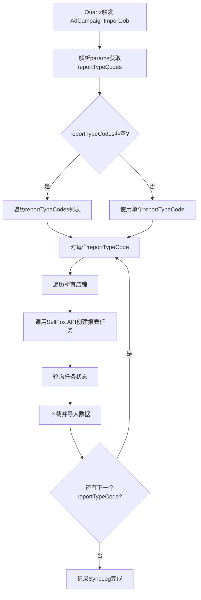

# 广告报告任务批量参数设计方案

## 1. 背景与目标

当前 `sync_task` 表中 `ad_campaign_import` 任务的 `params` 只支持单个 `adTypeCode` + `reportTypeCode` 组合。根据业务需求，共有 22 种有效组合，如果逐一配置需要 22 条任务记录。

**目标：** 将 22 个任务缩减为 3 个任务（按 `adTypeCode` 分组），每个任务内部循环处理多个 `reportTypeCode`。

## 2. 组合矩阵

| reportTypeCode | sp | sb | sd |
|---|:---:|:---:|:---:|
| adCampaignReport | ✓ | ✓ | ✓ |
| adGroupReport | ✓ | ✓ | ✓ |
| adProductReport | ✓ | ✓ | ✓ |
| adSpaceReport | ✓ | ✓ | ✗ |
| adTargeringReport | ✓ | ✓ | ✗ |
| adSearchTermReport | ✓ | ✓ | ✗ |
| adPurchasedItemReport | ✓ | ✓ | ✓ |
| amazonBusinessReport | ✓ | ✗ | ✗ |
| adCampaignMatchedTargetReport | ✗ | ✗ | ✓ |
| sdTargetListReport | ✗ | ✗ | ✓ |

- sp: 8 种报告
- sb: 7 种报告（注意 sb 没有 amazonBusinessReport）
- sd: 6 种报告（注意 sd 的投放报告用 sdTargetListReport 而非 adTargeringReport）

## 3. 新 params JSON Schema

### 3.1 字段变更

| 字段 | 旧 | 新 | 说明 |
|---|---|---|---|
| reportTypeCode | string | 保留，向后兼容 | 单个报告类型 |
| reportTypeCodes | - | List of String | 批量报告类型数组 |

**优先级规则：** 如果 `reportTypeCodes` 存在且非空，则使用数组；否则回退到 `reportTypeCode` 单值。

### 3.2 三个任务的 params 配置

**任务 1002: ad_report_import_sp**

```json
{
  "timeUnit": "daily",
  "adTypeCode": "sp",
  "reportTypeCodes": [
    "adCampaignReport",
    "adGroupReport",
    "adProductReport",
    "adSpaceReport",
    "adTargeringReport",
    "adSearchTermReport",
    "adPurchasedItemReport",
    "amazonBusinessReport"
  ],
  "startDateExpr": "T(java.time.LocalDate).now().minusDays(1).toString()",
  "endDateExpr": "T(java.time.LocalDate).now().toString()",
  "deleteDateExpr": "T(java.time.LocalDate).now().minusDays(1).toString()"
}
```

**任务 1003: ad_report_import_sb**

```json
{
  "timeUnit": "daily",
  "adTypeCode": "sb",
  "reportTypeCodes": [
    "adCampaignReport",
    "adGroupReport",
    "adProductReport",
    "adSpaceReport",
    "adTargeringReport",
    "adSearchTermReport",
    "adPurchasedItemReport"
  ],
  "startDateExpr": "T(java.time.LocalDate).now().minusDays(1).toString()",
  "endDateExpr": "T(java.time.LocalDate).now().toString()",
  "deleteDateExpr": "T(java.time.LocalDate).now().minusDays(1).toString()"
}
```

**任务 1004: ad_report_import_sd**

```json
{
  "timeUnit": "daily",
  "adTypeCode": "sd",
  "reportTypeCodes": [
    "adCampaignReport",
    "adGroupReport",
    "adProductReport",
    "adPurchasedItemReport",
    "adCampaignMatchedTargetReport",
    "sdTargetListReport"
  ],
  "startDateExpr": "T(java.time.LocalDate).now().minusDays(1).toString()",
  "endDateExpr": "T(java.time.LocalDate).now().toString()",
  "deleteDateExpr": "T(java.time.LocalDate).now().minusDays(1).toString()"
}
```

## 4. 执行流程



## 5. 代码改动清单

### 5.1 AdCampaignImportParams.java

```java
package com.hof.wms.integration.model;

import lombok.Data;
import java.util.List;

@Data
public class AdCampaignImportParams {
    private String adTypeCode;
    private String reportTypeCode;        // 保留，向后兼容
    private List<String> reportTypeCodes; // 新增：批量报告类型
    private String timeUnit;
    private String startDateExpr;
    private String endDateExpr;
    private String deleteDateExpr;

    /**
     * 获取有效的报告类型列表
     * 优先使用 reportTypeCodes，回退到 reportTypeCode
     */
    public List<String> getEffectiveReportTypeCodes() {
        if (reportTypeCodes != null && !reportTypeCodes.isEmpty()) {
            return reportTypeCodes;
        }
        if (reportTypeCode != null && !reportTypeCode.isEmpty()) {
            return List.of(reportTypeCode);
        }
        return List.of();
    }
}
```

### 5.2 AdCampaignImportJob.execute() 核心改动

```java
@Override
public void execute(JobExecutionContext context) {
    // ... 前置代码不变 ...

    AdCampaignImportParams params = sfImportService.resolveParams(
        paramsJson, AdCampaignImportParams.class);
    String adTypeCode = params.getAdTypeCode();
    List<String> reportTypeCodes = params.getEffectiveReportTypeCodes();

    // ... 获取token、获取店铺列表 ...

    int totalImported = 0;
    int failCount = 0;

    for (String reportTypeCode : reportTypeCodes) {
        log.info("开始处理报告类型: {} (广告类型: {})", reportTypeCode, adTypeCode);
        for (ShopInfo shop : shops) {
            try {
                int imported = processShop(shop, adTypeCode, reportTypeCode,
                    timeUnit, reportStartDate, reportEndDate, deleteDate);
                totalImported += imported;
            } catch (Exception e) {
                failCount++;
                log.error("处理店铺 {} 报告类型 {} 失败: {}",
                    shop.getName(), reportTypeCode, e.getMessage());
            }
        }
    }

    // ... 后续日志记录不变 ...
}
```

### 5.3 SfImportService.resolveSpelFields() 改动

当前 `resolveSpelFields` 只处理 `String` 类型字段。`reportTypeCodes` 是 `List<String>`，其中不含 SpEL 表达式，无需特殊处理。无需改动此方法。

### 5.4 SQL 迁移脚本 (07_ad_report_batch_tasks.sql)

```sql
-- 删除旧的单一广告任务
DELETE FROM integration.sync_task WHERE task_name = 'ad_campaign_import';

-- SP 广告报告导入任务
INSERT INTO integration.sync_task (
    id, task_name, system_name, api_url, auth_type, sync_type,
    trigger_type, cron_expr, status, params, params_class,
    enabled, description, created_at, updated_at
) VALUES (
    1002, 'ad_report_import_sp', 'SellFox',
    'https://openapi.sellfox.com', 'hmac', 'AD_CAMPAIGN',
    'CRON', '0 30 2 * * ?', 'active',
    '{
        "timeUnit": "daily",
        "adTypeCode": "sp",
        "reportTypeCodes": [
            "adCampaignReport", "adGroupReport", "adProductReport",
            "adSpaceReport", "adTargeringReport", "adSearchTermReport",
            "adPurchasedItemReport", "amazonBusinessReport"
        ],
        "startDateExpr": "T(java.time.LocalDate).now().minusDays(1).toString()",
        "endDateExpr": "T(java.time.LocalDate).now().toString()",
        "deleteDateExpr": "T(java.time.LocalDate).now().minusDays(1).toString()"
    }'::jsonb,
    'com.hof.wms.integration.model.AdCampaignImportParams',
    TRUE, 'SP广告报告批量导入(8种报告类型)',
    CURRENT_TIMESTAMP, CURRENT_TIMESTAMP
) ON CONFLICT (task_name) DO UPDATE SET
    params = EXCLUDED.params,
    description = EXCLUDED.description,
    updated_at = CURRENT_TIMESTAMP;

-- SB 广告报告导入任务
INSERT INTO integration.sync_task (
    id, task_name, system_name, api_url, auth_type, sync_type,
    trigger_type, cron_expr, status, params, params_class,
    enabled, description, created_at, updated_at
) VALUES (
    1003, 'ad_report_import_sb', 'SellFox',
    'https://openapi.sellfox.com', 'hmac', 'AD_CAMPAIGN',
    'CRON', '0 0 3 * * ?', 'active',
    '{
        "timeUnit": "daily",
        "adTypeCode": "sb",
        "reportTypeCodes": [
            "adCampaignReport", "adGroupReport", "adProductReport",
            "adSpaceReport", "adTargeringReport", "adSearchTermReport",
            "adPurchasedItemReport"
        ],
        "startDateExpr": "T(java.time.LocalDate).now().minusDays(1).toString()",
        "endDateExpr": "T(java.time.LocalDate).now().toString()",
        "deleteDateExpr": "T(java.time.LocalDate).now().minusDays(1).toString()"
    }'::jsonb,
    'com.hof.wms.integration.model.AdCampaignImportParams',
    TRUE, 'SB广告报告批量导入(7种报告类型)',
    CURRENT_TIMESTAMP, CURRENT_TIMESTAMP
) ON CONFLICT (task_name) DO UPDATE SET
    params = EXCLUDED.params,
    description = EXCLUDED.description,
    updated_at = CURRENT_TIMESTAMP;

-- SD 广告报告导入任务
INSERT INTO integration.sync_task (
    id, task_name, system_name, api_url, auth_type, sync_type,
    trigger_type, cron_expr, status, params, params_class,
    enabled, description, created_at, updated_at
) VALUES (
    1004, 'ad_report_import_sd', 'SellFox',
    'https://openapi.sellfox.com', 'hmac', 'AD_CAMPAIGN',
    'CRON', '0 30 3 * * ?', 'active',
    '{
        "timeUnit": "daily",
        "adTypeCode": "sd",
        "reportTypeCodes": [
            "adCampaignReport", "adGroupReport", "adProductReport",
            "adPurchasedItemReport", "adCampaignMatchedTargetReport",
            "sdTargetListReport"
        ],
        "startDateExpr": "T(java.time.LocalDate).now().minusDays(1).toString()",
        "endDateExpr": "T(java.time.LocalDate).now().toString()",
        "deleteDateExpr": "T(java.time.LocalDate).now().minusDays(1).toString()"
    }'::jsonb,
    'com.hof.wms.integration.model.AdCampaignImportParams',
    TRUE, 'SD广告报告批量导入(6种报告类型)',
    CURRENT_TIMESTAMP, CURRENT_TIMESTAMP
) ON CONFLICT (task_name) DO UPDATE SET
    params = EXCLUDED.params,
    description = EXCLUDED.description,
    updated_at = CURRENT_TIMESTAMP;
```

## 6. 调度时间规划

| 任务 | cron | 说明 |
|---|---|---|
| ad_report_import_sp | 0 30 2 * * ? | 凌晨 2:30 |
| ad_report_import_sb | 0 0 3 * * ? | 凌晨 3:00 |
| ad_report_import_sd | 0 30 3 * * ? | 凌晨 3:30 |

错开 30 分钟执行，避免 API 并发压力。

## 7. 向后兼容性

- `reportTypeCode` 单值字段保留，`getEffectiveReportTypeCodes()` 方法优先取数组，回退到单值
- 如果数据库中仍有旧格式的 params（只有 reportTypeCode），Job 仍能正常执行
- 无需修改 SyncTask entity 或 sync_task 表结构

## 8. 错误处理策略

- 单个 reportTypeCode 失败不影响其他报告类型的执行
- SyncLog 中记录总体状态：全部成功为 success，部分失败为 partial
- `last_execute_message` 中记录每种报告类型的导入结果摘要

## 9. 实施步骤

1. 修改 `AdCampaignImportParams` 添加 `reportTypeCodes` 字段和 `getEffectiveReportTypeCodes()` 方法
2. 修改 `AdCampaignImportJob.execute()` 添加 reportTypeCodes 循环逻辑
3. 创建 SQL 迁移脚本 `07_ad_report_batch_tasks.sql`
4. 测试向后兼容性（旧格式 params 仍可执行）
5. 部署并验证
