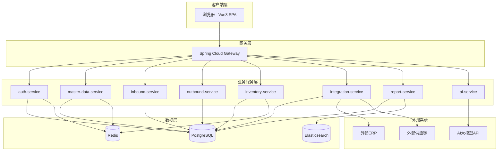
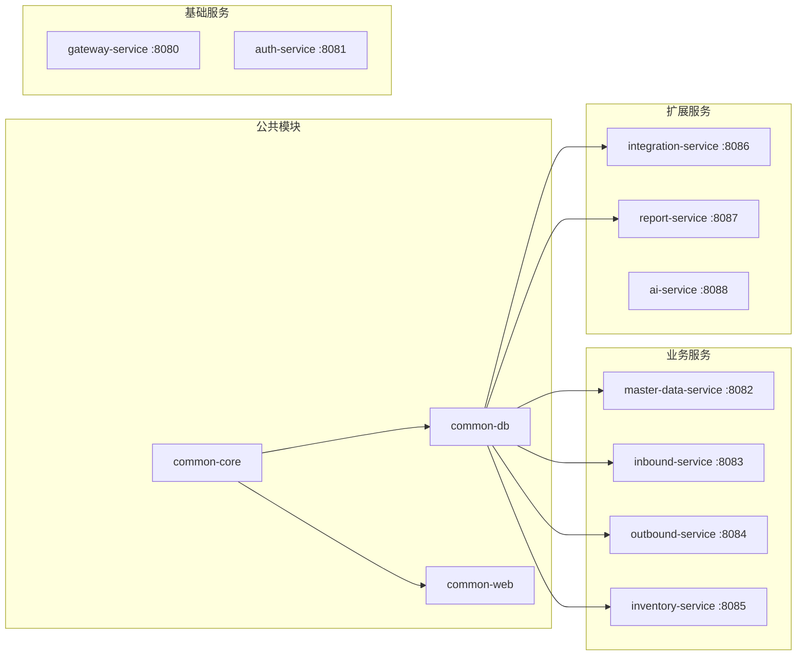
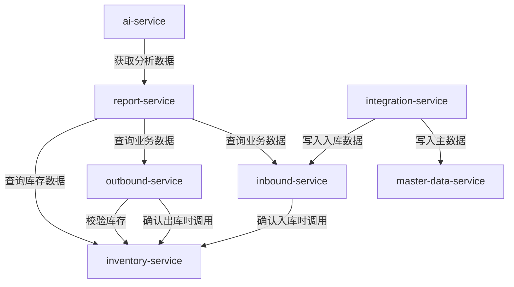
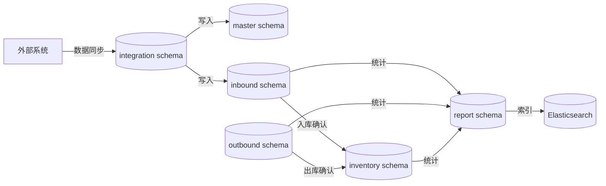
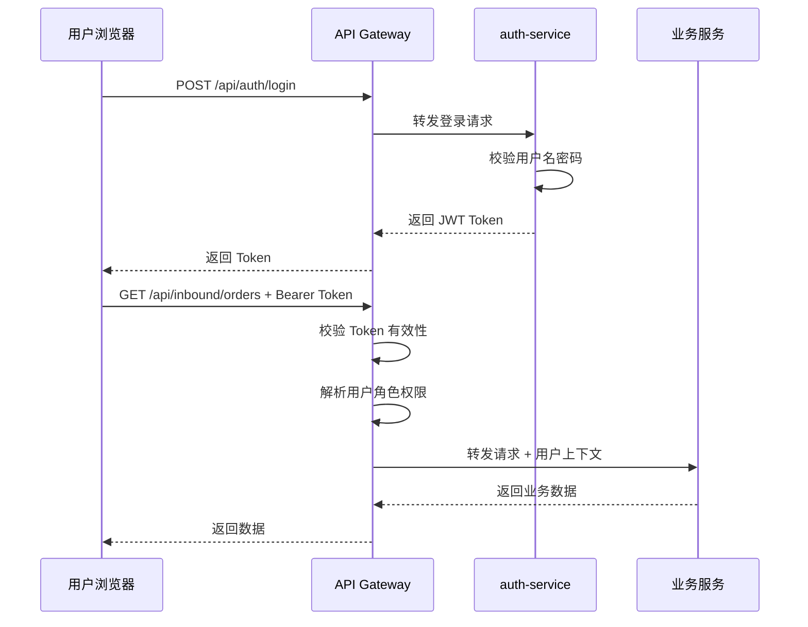
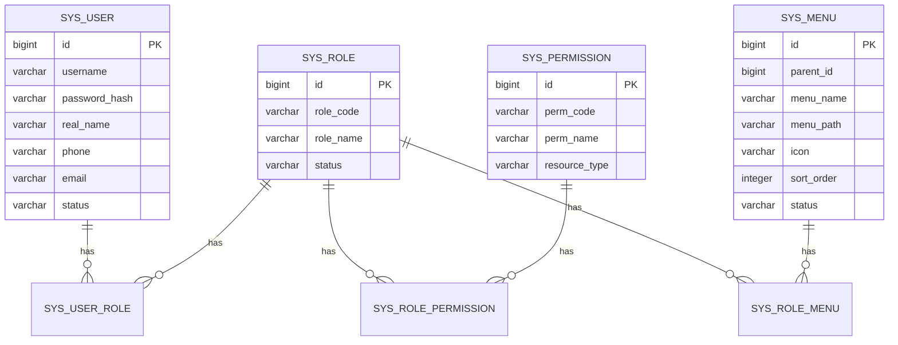
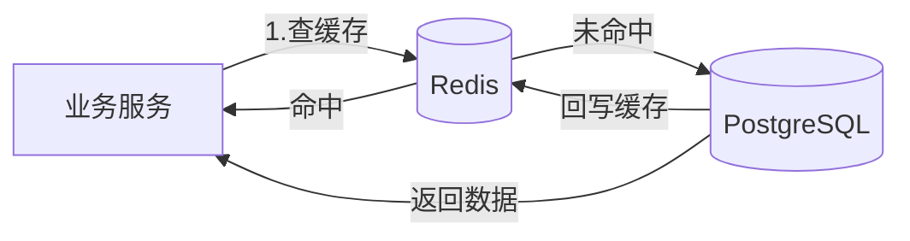
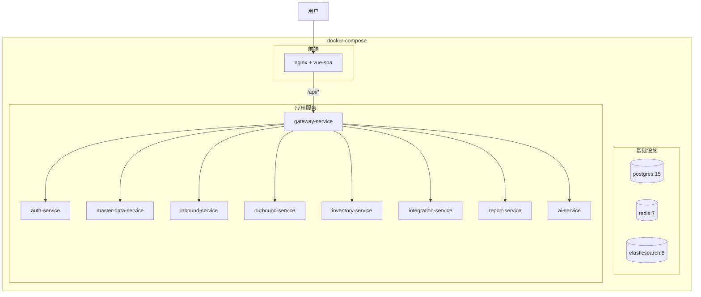

# 架构设计文档

## 1. 文档概述

### 1.1 项目名称
HOF-WMS 仓储管理系统

### 1.2 项目目标
构建一套涵盖进货、销售、库存管理的仓储管理系统，支持外部系统数据对接、报表生成与 AI 智能分析，满足企业仓储业务数字化管理需求。

### 1.3 设计原则

| 原则 | 说明 |
|------|------|
| 高内聚低耦合 | 各服务职责单一，通过接口通信 |
| 可扩展性 | 模块化设计，新业务可快速接入 |
| 可观测性 | 统一日志、链路追踪、指标监控 |
| 安全性 | 认证鉴权、数据加密、审计日志 |
| 容器化部署 | Docker 容器化，环境一致性 |

---

## 2. 系统总体架构

### 2.1 架构分层图

### 2.2 技术架构分层

| 层次 | 技术选型 | 职责 |
|------|----------|------|
| 展示层 | Vue3 + Element Plus | 用户界面交互 |
| 网关层 | Spring Cloud Gateway | 路由、鉴权、限流、日志 |
| 业务层 | Spring Boot 3.x | 业务逻辑处理 |
| 数据访问层 | MyBatis-Plus | ORM 映射、数据操作 |
| 缓存层 | Redis | 热点数据缓存、分布式锁、会话管理 |
| 搜索层 | Elasticsearch | 全文检索、报表数据加速查询 |
| 持久层 | PostgreSQL | 业务数据持久化 |
| 部署层 | Docker + docker-compose | 容器化部署与编排 |

---

## 3. 微服务架构设计

### 3.1 服务清单

### 3.2 服务间通信

| 通信方式 | 场景 | 说明 |
|----------|------|------|
| HTTP REST | 同步调用 | 服务间通过 OpenFeign 调用 |
| 事件驱动 | 异步通知 | 入库/出库完成后通知库存服务更新 |
| 定时任务 | 调度触发 | 数据同步定时任务 |

### 3.3 服务间调用关系

---

## 4. 数据架构设计

### 4.1 数据库设计原则

- 每个微服务独立数据库 Schema，避免跨服务直接访问数据库
- 使用逻辑删除，不做物理删除
- 所有表包含 created_at, updated_at, created_by, updated_by 审计字段
- 主键使用雪花算法生成的 bigint
- 金额字段使用 numeric(18,2)，数量字段使用 numeric(18,4)

### 4.2 数据库 Schema 划分

| Schema | 服务 | 核心表 |
|--------|------|--------|
| auth | auth-service | sys_user, sys_role, sys_permission, sys_user_role, sys_role_permission |
| master | master-data-service | product, warehouse, supplier, customer |
| inbound | inbound-service | inbound_order, inbound_order_item, inbound_record |
| outbound | outbound-service | outbound_order, outbound_order_item, outbound_record |
| inventory | inventory-service | inventory, inventory_transaction, inventory_check_order, inventory_check_item |
| integration | integration-service | sync_task, sync_field_mapping, sync_log |
| report | report-service | report_task, ai_analysis_record |

### 4.3 数据流向图

---

## 5. 安全架构设计

### 5.1 认证流程

### 5.2 RBAC 权限模型

### 5.3 预设角色

| 角色 | 权限范围 |
|------|----------|
| 超级管理员 | 全部权限 |
| 仓库管理员 | 入库、出库、库存全部操作 |
| 入库员 | 入库单创建、编辑、提交 |
| 出库员 | 出库单创建、编辑、提交 |
| 审核员 | 入库/出库单审核 |
| 数据管理员 | 数据对接模块全部操作 |
| 报表查看员 | 报表查看、导出 |

---

## 6. 缓存架构设计

### 6.1 缓存策略

| 缓存对象 | Key 格式 | 过期时间 | 更新策略 |
|----------|----------|----------|----------|
| 用户 Token | auth:token:{userId} | 2h | 登录刷新 |
| 用户权限 | auth:perm:{userId} | 30min | 权限变更时删除 |
| 商品信息 | master:product:{id} | 1h | 更新时删除 |
| 仓库信息 | master:warehouse:{id} | 1h | 更新时删除 |
| 字典数据 | master:dict:{type} | 2h | 更新时删除 |
| 库存锁 | inventory:lock:{warehouseId}:{productId} | 30s | 自动过期 |

### 6.2 缓存架构图

---

## 7. 部署架构设计

### 7.1 Docker 部署拓扑

### 7.2 端口规划

| 服务 | 端口 |
|------|------|
| Nginx - 前端 | 80 |
| gateway-service | 8080 |
| auth-service | 8081 |
| master-data-service | 8082 |
| inbound-service | 8083 |
| outbound-service | 8084 |
| inventory-service | 8085 |
| integration-service | 8086 |
| report-service | 8087 |
| ai-service | 8088 |
| PostgreSQL | 5432 |
| Redis | 6379 |
| Elasticsearch | 9200 |

---

## 8. 可观测性设计

### 8.1 日志规范

- 统一日志格式：JSON 结构化日志
- 必含字段：timestamp, traceId, spanId, service, level, message
- 日志级别：ERROR > WARN > INFO > DEBUG
- 生产环境默认 INFO 级别

### 8.2 监控指标

| 指标类型 | 指标项 |
|----------|--------|
| 业务指标 | 入库单数量、出库单数量、库存预警数 |
| 性能指标 | 接口响应时间 P99、QPS |
| 系统指标 | CPU、内存、磁盘使用率 |
| 同步指标 | 同步成功率、同步延迟 |
