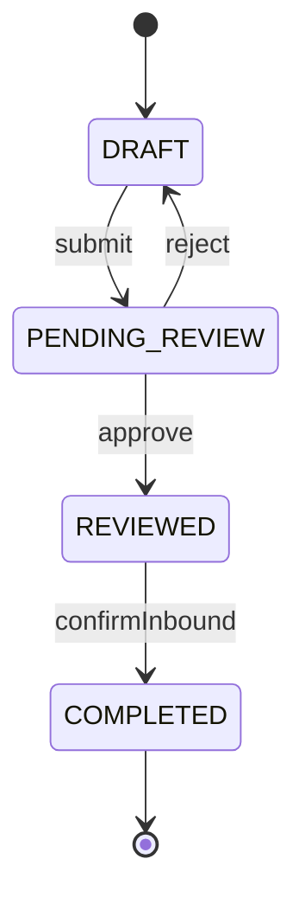
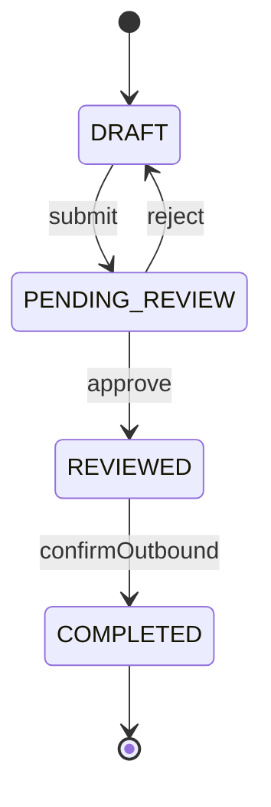
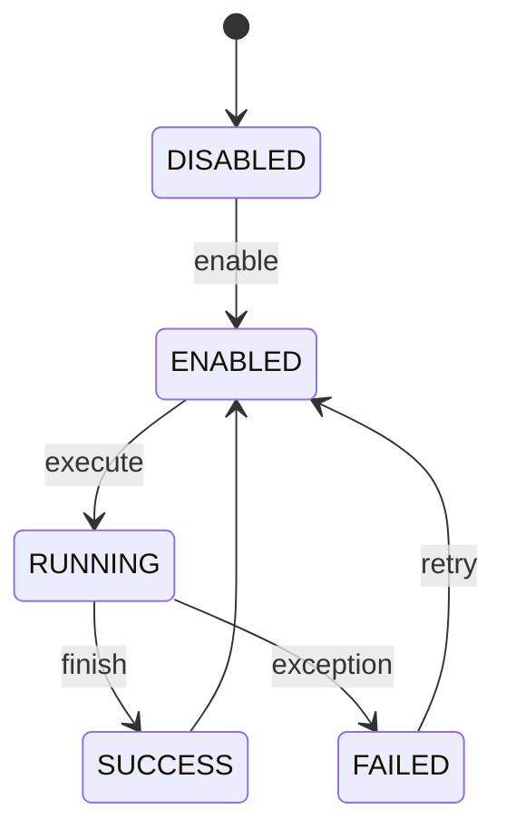
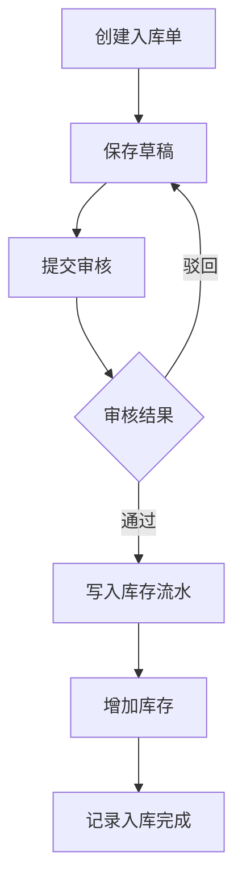
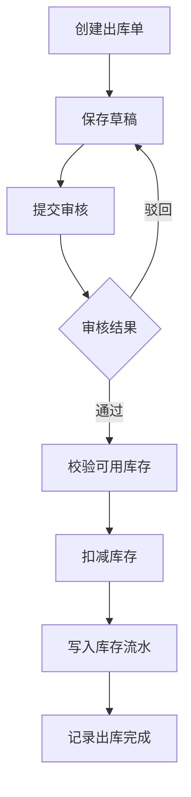
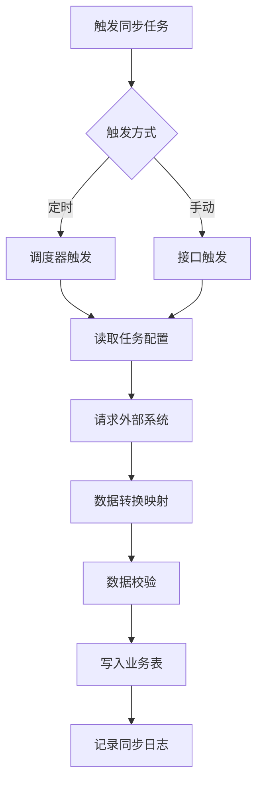

# 后端详细设计文档

## 1. 技术架构

## 1.1 技术栈

| 技术 | 用途 |
|------|------|
| Java 17 | 开发语言 |
| Spring Boot 3.x | 基础应用框架 |
| Spring Cloud | 微服务治理 |
| MyBatis-Plus | ORM 框架 |
| PostgreSQL | 主数据库 |
| Redis | 缓存、分布式锁 |
| Elasticsearch | 全文检索、报表查询加速 |
| Docker | 容器化部署 |
| JUnit 5 | 单元测试 |

## 1.2 微服务拆分

```
backend/
├── gateway-service/              # API 网关服务
├── auth-service/                 # 认证授权服务
├── master-data-service/          # 主数据服务-商品、供应商、客户、仓库
├── inbound-service/              # 入库服务
├── outbound-service/             # 出库/销售服务
├── inventory-service/            # 库存服务
├── integration-service/          # 数据对接服务
├── report-service/               # 报表服务
├── ai-service/                   # AI 分析服务
├── common-core/                  # 公共基础模块
├── common-db/                    # 数据访问公共模块
└── common-web/                   # Web 公共模块
```

## 1.3 服务职责

| 服务名 | 核心职责 |
|--------|----------|
| gateway-service | 路由转发、统一鉴权、限流、日志追踪 |
| auth-service | 登录认证、Token 签发、权限校验 |
| master-data-service | 商品、仓库、供应商、客户主数据维护 |
| inbound-service | 入库单管理、入库审核、入库确认 |
| outbound-service | 出库单管理、销售出库、出库审核 |
| inventory-service | 实时库存、库存流水、盘点、预警 |
| integration-service | 外部系统接入、任务配置、同步调度、同步日志 |
| report-service | 报表计算、导出、报表查询 |
| ai-service | 智能分析、预测、AI 问答接口 |

## 2. 核心业务设计

## 2.1 领域模型

### 2.1.1 主数据实体

| 实体 | 关键字段 |
|------|----------|
| Product | id, skuCode, productName, categoryId, unit, status |
| Warehouse | id, warehouseCode, warehouseName, address, status |
| Supplier | id, supplierCode, supplierName, contactName, phone, status |
| Customer | id, customerCode, customerName, contactName, phone, status |

### 2.1.2 入库领域实体

| 实体 | 关键字段 |
|------|----------|
| InboundOrder | id, orderNo, supplierId, warehouseId, orderType, status, totalAmount, remark, createdBy, createdAt |
| InboundOrderItem | id, orderId, productId, skuCode, productName, quantity, unitPrice, amount |
| InboundRecord | id, orderId, inboundTime, operatorId |

### 2.1.3 出库领域实体

| 实体 | 关键字段 |
|------|----------|
| OutboundOrder | id, orderNo, customerId, warehouseId, orderType, status, totalAmount, remark, createdBy, createdAt |
| OutboundOrderItem | id, orderId, productId, skuCode, productName, quantity, unitPrice, amount |
| OutboundRecord | id, orderId, outboundTime, operatorId |

### 2.1.4 库存领域实体

| 实体 | 关键字段 |
|------|----------|
| Inventory | id, warehouseId, productId, availableQty, lockedQty, totalQty, safetyStock |
| InventoryTransaction | id, bizType, bizOrderNo, warehouseId, productId, changeQty, beforeQty, afterQty, direction, operateTime |
| InventoryCheckOrder | id, checkNo, warehouseId, status, checkDate, createdBy |
| InventoryCheckItem | id, checkOrderId, productId, systemQty, actualQty, diffQty |

### 2.1.5 数据对接实体

| 实体 | 关键字段 |
|------|----------|
| SyncTask | id, taskName, systemName, apiUrl, authType, syncType, triggerType, cronExpr, status |
| SyncFieldMapping | id, taskId, sourceField, targetField, convertRule |
| SyncLog | id, taskId, startTime, endTime, syncCount, successCount, failCount, status, errorMessage |

### 2.1.6 报表与 AI 实体

| 实体 | 关键字段 |
|------|----------|
| ReportTask | id, reportType, queryParams, generateStatus, filePath, createdBy, createdAt |
| AiAnalysisRecord | id, analysisType, inputParams, resultText, resultJson, createdAt |

## 2.2 业务状态机设计

### 2.2.1 入库单状态



### 2.2.2 出库单状态



### 2.2.3 同步任务状态



## 3. 数据库设计

## 3.1 表设计清单

| 表名 | 说明 |
|------|------|
| product | 商品表 |
| warehouse | 仓库表 |
| supplier | 供应商表 |
| customer | 客户表 |
| inbound_order | 入库单主表 |
| inbound_order_item | 入库单明细表 |
| inbound_record | 入库记录表 |
| outbound_order | 出库单主表 |
| outbound_order_item | 出库单明细表 |
| outbound_record | 出库记录表 |
| inventory | 库存表 |
| inventory_transaction | 库存流水表 |
| inventory_check_order | 盘点单表 |
| inventory_check_item | 盘点明细表 |
| sync_task | 同步任务表 |
| sync_field_mapping | 同步字段映射表 |
| sync_log | 同步日志表 |
| report_task | 报表任务表 |
| ai_analysis_record | AI 分析记录表 |

## 3.2 核心表详细设计

### 3.2.1 inbound_order

| 字段 | 类型 | 说明 |
|------|------|------|
| id | bigint | 主键 |
| order_no | varchar(64) | 入库单号, 唯一索引 |
| supplier_id | bigint | 供应商ID |
| warehouse_id | bigint | 仓库ID |
| order_type | varchar(32) | 入库类型 |
| status | varchar(32) | 单据状态 |
| total_amount | numeric(18,2) | 总金额 |
| remark | varchar(500) | 备注 |
| created_by | bigint | 创建人 |
| created_at | timestamp | 创建时间 |
| updated_by | bigint | 更新人 |
| updated_at | timestamp | 更新时间 |
| deleted | boolean | 逻辑删除标记 |

索引设计:
- uk_order_no on order_no
- idx_supplier_id on supplier_id
- idx_warehouse_id on warehouse_id
- idx_status on status
- idx_created_at on created_at

### 3.2.2 inventory

| 字段 | 类型 | 说明 |
|------|------|------|
| id | bigint | 主键 |
| warehouse_id | bigint | 仓库ID |
| product_id | bigint | 商品ID |
| available_qty | numeric(18,4) | 可用库存 |
| locked_qty | numeric(18,4) | 锁定库存 |
| total_qty | numeric(18,4) | 总库存 |
| safety_stock | numeric(18,4) | 安全库存 |
| version | integer | 乐观锁版本号 |
| updated_at | timestamp | 更新时间 |

索引设计:
- uk_warehouse_product on warehouse_id, product_id
- idx_safety_stock on safety_stock

### 3.2.3 sync_task

| 字段 | 类型 | 说明 |
|------|------|------|
| id | bigint | 主键 |
| task_name | varchar(128) | 任务名称 |
| system_name | varchar(64) | 外部系统名称 |
| api_url | varchar(500) | 接口地址 |
| auth_type | varchar(32) | 认证方式 |
| auth_config | jsonb | 认证配置 |
| sync_type | varchar(32) | 同步类型-增量/全量 |
| trigger_type | varchar(32) | 触发方式-定时/手动 |
| cron_expr | varchar(64) | 定时表达式 |
| last_sync_time | timestamp | 上次同步时间 |
| status | varchar(32) | 状态 |
| created_at | timestamp | 创建时间 |
| updated_at | timestamp | 更新时间 |

## 4. 接口设计

## 4.1 统一接口规范

请求头:
- Authorization: Bearer {token}
- Content-Type: application/json
- X-Trace-Id: 请求追踪ID

响应格式:

```java
public class ApiResult<T> {
    private Integer code;
    private String message;
    private T data;
}
```

分页响应:

```java
public class PageResult<T> {
    private List<T> records;
    private Long total;
    private Long current;
    private Long size;
}
```

## 4.2 入库模块接口

| 方法 | 路径 | 说明 |
|------|------|------|
| POST | /api/inbound/orders | 创建入库单 |
| PUT | /api/inbound/orders/{id} | 更新入库单 |
| GET | /api/inbound/orders/{id} | 查询入库单详情 |
| GET | /api/inbound/orders | 分页查询入库单 |
| POST | /api/inbound/orders/{id}/submit | 提交审核 |
| POST | /api/inbound/orders/{id}/approve | 审核通过 |
| POST | /api/inbound/orders/{id}/reject | 审核驳回 |
| POST | /api/inbound/orders/{id}/confirm | 确认入库 |

### 4.2.1 创建入库单请求体

```java
public class InboundOrderCreateRequest {
    private Long supplierId;
    private Long warehouseId;
    private String orderType;
    private String remark;
    private List<InboundOrderItemRequest> items;
}
```

## 4.3 出库模块接口

| 方法 | 路径 | 说明 |
|------|------|------|
| POST | /api/outbound/orders | 创建出库单 |
| PUT | /api/outbound/orders/{id} | 更新出库单 |
| GET | /api/outbound/orders/{id} | 查询出库单详情 |
| GET | /api/outbound/orders | 分页查询出库单 |
| POST | /api/outbound/orders/{id}/submit | 提交审核 |
| POST | /api/outbound/orders/{id}/approve | 审核通过 |
| POST | /api/outbound/orders/{id}/reject | 审核驳回 |
| POST | /api/outbound/orders/{id}/confirm | 确认出库 |

## 4.4 库存模块接口

| 方法 | 路径 | 说明 |
|------|------|------|
| GET | /api/inventory | 分页查询库存 |
| GET | /api/inventory/{productId} | 查询商品库存详情 |
| GET | /api/inventory/transactions | 查询库存流水 |
| POST | /api/inventory/check-orders | 创建盘点单 |
| GET | /api/inventory/check-orders/{id} | 查询盘点单详情 |
| POST | /api/inventory/check-orders/{id}/submit | 提交盘点 |
| GET | /api/inventory/alerts | 查询库存预警列表 |
| PUT | /api/inventory/safety-stock | 批量设置安全库存 |

## 4.5 数据对接模块接口

| 方法 | 路径 | 说明 |
|------|------|------|
| POST | /api/sync/tasks | 创建同步任务 |
| PUT | /api/sync/tasks/{id} | 更新同步任务 |
| GET | /api/sync/tasks/{id} | 查询同步任务详情 |
| GET | /api/sync/tasks | 分页查询同步任务 |
| POST | /api/sync/tasks/{id}/test | 测试连接 |
| POST | /api/sync/tasks/{id}/execute | 手动执行同步 |
| POST | /api/sync/tasks/{id}/enable | 启用任务 |
| POST | /api/sync/tasks/{id}/disable | 停用任务 |
| GET | /api/sync/logs | 分页查询同步日志 |

## 4.6 报表模块接口

| 方法 | 路径 | 说明 |
|------|------|------|
| GET | /api/reports/summary | 获取报表汇总数据 |
| POST | /api/reports/generate | 生成报表 |
| GET | /api/reports/{taskId}/download | 下载报表文件 |
| POST | /api/reports/ai-analysis | AI 智能分析 |
| POST | /api/reports/forecast | 趋势预测 |

## 5. 核心流程设计

## 5.1 入库确认流程



处理要点:
- 入库确认前校验单据状态必须为 REVIEWED
- 使用事务保证单据状态更新、库存更新、库存流水写入一致
- 库存更新采用乐观锁控制并发
- 入库完成后发送报表统计事件

## 5.2 出库确认流程



处理要点:
- 出库前校验 available_qty 是否充足
- 并发出库时使用 Redis 分布式锁或数据库乐观锁
- 库存不足返回明确业务错误码

## 5.3 数据同步流程



处理要点:
- 增量同步基于 last_sync_time 提取数据
- 全量同步支持分页拉取和断点续传
- 字段映射规则支持固定值、格式转换、枚举映射
- 同步异常需记录失败明细

## 6. 非功能设计

## 6.1 安全设计

- JWT Token 认证
- 基于角色的权限控制 RBAC
- 接口参数合法性校验
- 敏感日志脱敏
- 外部接口密钥加密存储

## 6.2 性能设计

- 主数据和高频字典缓存到 Redis
- 报表查询结果写入 Elasticsearch 提升检索效率
- 大报表生成走异步任务
- 分页查询默认限制每页最大 200 条

## 6.3 可观测性设计

- 统一 traceId 日志链路
- 同步任务执行指标监控
- 库存变更审计日志
- 慢 SQL 监控

## 7. 测试设计

## 7.1 单元测试范围

| 模块 | 测试重点 |
|------|----------|
| 入库服务 | 状态流转、金额计算、库存增加 |
| 出库服务 | 库存校验、库存扣减、异常处理 |
| 库存服务 | 库存计算、盘点差异处理、预警判断 |
| 同步服务 | 增量/全量同步、字段映射、错误重试 |
| 报表服务 | 报表统计、导出、AI 接口适配 |

## 7.2 集成测试范围

- 入库完成后库存联动正确
- 出库完成后库存联动正确
- 数据同步写入业务数据正确
- 报表导出文件可下载
- AI 分析接口结果可正常返回
