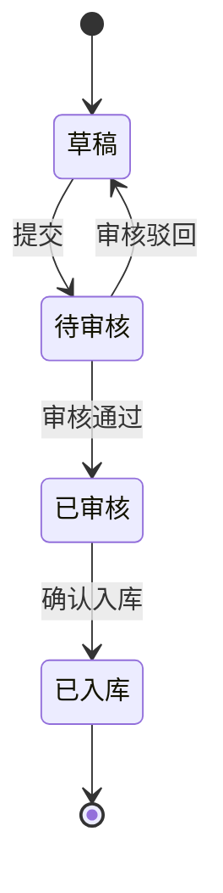

# 前端详细设计文档

## 1. 技术栈

| 技术 | 版本 | 用途 |
|------|------|------|
| Vue 3 | 3.4+ | 前端框架 |
| Vite | 5.x | 构建工具 |
| TypeScript | 5.x | 类型安全 |
| Element Plus | 2.x | UI 组件库 |
| Vue Router | 4.x | 路由管理 |
| Pinia | 2.x | 状态管理 |
| Axios | 1.x | HTTP 请求 |
| ECharts | 5.x | 报表图表 |

## 2. 项目目录结构

```
frontend/
├── public/
├── src/
│   ├── api/                    # API 接口层
│   │   ├── inbound.ts          # 入库相关接口
│   │   ├── outbound.ts         # 出库/销售相关接口
│   │   ├── inventory.ts        # 库存相关接口
│   │   ├── data-sync.ts        # 数据对接相关接口
│   │   ├── report.ts           # 报表相关接口
│   │   └── request.ts          # Axios 封装
│   ├── assets/                 # 静态资源
│   ├── components/             # 公共组件
│   │   ├── TablePro/           # 通用表格组件
│   │   ├── FormPro/            # 通用表单组件
│   │   ├── SearchBar/          # 搜索栏组件
│   │   └── ExportButton/       # 导出按钮组件
│   ├── composables/            # 组合式函数
│   │   ├── useTable.ts         # 表格逻辑
│   │   ├── usePagination.ts    # 分页逻辑
│   │   └── useExport.ts        # 导出逻辑
│   ├── layouts/                # 布局组件
│   │   └── DefaultLayout.vue
│   ├── router/                 # 路由配置
│   │   └── index.ts
│   ├── stores/                 # Pinia 状态管理
│   │   ├── user.ts
│   │   ├── inbound.ts
│   │   ├── outbound.ts
│   │   ├── inventory.ts
│   │   └── app.ts
│   ├── types/                  # TypeScript 类型定义
│   │   ├── inbound.d.ts
│   │   ├── outbound.d.ts
│   │   ├── inventory.d.ts
│   │   ├── data-sync.d.ts
│   │   └── report.d.ts
│   ├── utils/                  # 工具函数
│   │   ├── format.ts
│   │   ├── validate.ts
│   │   └── storage.ts
│   ├── views/                  # 页面视图
│   │   ├── inbound/            # 入库模块
│   │   ├── outbound/           # 出库/销售模块
│   │   ├── inventory/          # 库存模块
│   │   ├── data-sync/          # 数据对接模块
│   │   ├── report/             # 报表模块
│   │   └── login/              # 登录页
│   ├── App.vue
│   └── main.ts
├── .env.development
├── .env.production
├── index.html
├── package.json
├── tsconfig.json
└── vite.config.ts
```

## 3. 页面设计

### 3.1 全局布局

采用经典后台管理布局：左侧菜单 + 顶部导航 + 内容区域

```
┌──────────────────────────────────────────┐
│  Logo        顶部导航栏        用户信息   │
├────────┬─────────────────────────────────┤
│        │                                 │
│  侧边  │         内容区域                │
│  菜单  │                                 │
│        │                                 │
│        │                                 │
├────────┴─────────────────────────────────┤
│              底部信息栏                   │
└──────────────────────────────────────────┘
```

### 3.2 入库模块页面

#### 3.2.1 入库单列表页 `/inbound/list`

| 区域 | 组件 | 说明 |
|------|------|------|
| 搜索区 | SearchBar | 入库单号、供应商、状态、日期范围筛选 |
| 操作区 | Button Group | 新建入库单、批量导入、导出 |
| 列表区 | TablePro | 入库单号、供应商、入库类型、状态、创建时间、操作列 |
| 分页区 | Pagination | 分页控件 |

#### 3.2.2 入库单详情/编辑页 `/inbound/detail/:id`

| 区域 | 组件 | 说明 |
|------|------|------|
| 基本信息 | Form | 入库单号、供应商、入库类型、备注 |
| 商品明细 | EditableTable | 商品编码、名称、数量、单价、小计 |
| 操作按钮 | Button Group | 保存草稿、提交、审核通过、审核驳回 |

#### 3.2.3 入库单状态流转



### 3.3 出库/销售模块页面

#### 3.3.1 出库单列表页 `/outbound/list`

| 区域 | 组件 | 说明 |
|------|------|------|
| 搜索区 | SearchBar | 出库单号、客户、状态、日期范围筛选 |
| 操作区 | Button Group | 新建出库单、批量导出 |
| 列表区 | TablePro | 出库单号、客户、出库类型、状态、创建时间、操作列 |
| 分页区 | Pagination | 分页控件 |

#### 3.3.2 出库单详情/编辑页 `/outbound/detail/:id`

| 区域 | 组件 | 说明 |
|------|------|------|
| 基本信息 | Form | 出库单号、客户、出库类型、备注 |
| 商品明细 | EditableTable | 商品编码、名称、数量、单价、小计 |
| 操作按钮 | Button Group | 保存草稿、提交、审核、出库确认 |

### 3.4 库存模块页面

#### 3.4.1 库存查询页 `/inventory/list`

| 区域 | 组件 | 说明 |
|------|------|------|
| 搜索区 | SearchBar | 商品编码、名称、仓库、分类筛选 |
| 列表区 | TablePro | 商品编码、名称、分类、仓库、当前库存、安全库存、状态 |
| 分页区 | Pagination | 分页控件 |

#### 3.4.2 库存盘点页 `/inventory/check`

| 区域 | 组件 | 说明 |
|------|------|------|
| 盘点信息 | Form | 盘点单号、仓库、盘点日期 |
| 盘点明细 | EditableTable | 商品编码、名称、系统库存、实际库存、差异 |
| 操作按钮 | Button Group | 保存、提交盘点 |

#### 3.4.3 库存预警页 `/inventory/alert`

| 区域 | 组件 | 说明 |
|------|------|------|
| 预警列表 | TablePro | 商品编码、名称、当前库存、安全库存、预警类型 |
| 预警设置 | Dialog + Form | 设置安全库存阈值 |

### 3.5 数据对接模块页面

#### 3.5.1 同步任务列表页 `/data-sync/list`

| 区域 | 组件 | 说明 |
|------|------|------|
| 搜索区 | SearchBar | 任务名称、外部系统、状态筛选 |
| 操作区 | Button Group | 新建同步任务 |
| 列表区 | TablePro | 任务名称、外部系统、同步类型、同步方式、状态、上次执行时间、操作列 |

#### 3.5.2 同步任务配置页 `/data-sync/config/:id`

| 区域 | 组件 | 说明 |
|------|------|------|
| 基本信息 | Form | 任务名称、外部系统、接口地址、认证方式 |
| 同步配置 | Form | 同步类型-增量/全量、触发方式-定时/手动、Cron表达式 |
| 字段映射 | MappingTable | 源字段 -> 目标字段映射配置 |
| 操作按钮 | Button Group | 保存、测试连接、手动执行 |

#### 3.5.3 同步日志页 `/data-sync/log`

| 区域 | 组件 | 说明 |
|------|------|------|
| 搜索区 | SearchBar | 任务名称、执行状态、时间范围 |
| 列表区 | TablePro | 任务名称、开始时间、结束时间、同步数量、状态、错误信息 |

### 3.6 报表模块页面

#### 3.6.1 报表中心 `/report/center`

| 区域 | 组件 | 说明 |
|------|------|------|
| 报表分类 | Tabs | 入库报表、出库报表、库存报表、综合报表 |
| 报表卡片 | Card Grid | 各类报表入口卡片 |

#### 3.6.2 报表详情页 `/report/detail/:type`

| 区域 | 组件 | 说明 |
|------|------|------|
| 筛选区 | Form | 时间范围、仓库、分类等筛选条件 |
| 图表区 | ECharts | 柱状图、折线图、饼图等可视化 |
| 数据表 | TablePro | 报表明细数据 |
| 操作区 | Button Group | 导出Excel、导出PDF、下载 |

#### 3.6.3 AI 智能分析页 `/report/ai-analysis`

| 区域 | 组件 | 说明 |
|------|------|------|
| 对话区 | ChatPanel | AI 对话交互面板 |
| 分析结果 | ResultPanel | AI 分析结果展示-图表+文字 |
| 预测区 | PredictionChart | 库存预测、销售趋势预测图表 |

## 4. 路由设计

```typescript
const routes = [
  { path: '/login', component: Login },
  {
    path: '/',
    component: DefaultLayout,
    children: [
      // 首页仪表盘
      { path: 'dashboard', component: Dashboard },
      // 入库模块
      { path: 'inbound/list', component: InboundList },
      { path: 'inbound/detail/:id?', component: InboundDetail },
      // 出库/销售模块
      { path: 'outbound/list', component: OutboundList },
      { path: 'outbound/detail/:id?', component: OutboundDetail },
      // 库存模块
      { path: 'inventory/list', component: InventoryList },
      { path: 'inventory/check', component: InventoryCheck },
      { path: 'inventory/alert', component: InventoryAlert },
      // 数据对接模块
      { path: 'data-sync/list', component: DataSyncList },
      { path: 'data-sync/config/:id?', component: DataSyncConfig },
      { path: 'data-sync/log', component: DataSyncLog },
      // 报表模块
      { path: 'report/center', component: ReportCenter },
      { path: 'report/detail/:type', component: ReportDetail },
      { path: 'report/ai-analysis', component: AIAnalysis },
    ]
  }
]
```

## 5. 公共组件设计

### 5.1 TablePro 通用表格

| Props | 类型 | 说明 |
|-------|------|------|
| columns | ColumnConfig[] | 列配置 |
| api | Function | 数据请求函数 |
| searchFields | SearchField[] | 搜索字段配置 |
| pagination | boolean | 是否分页 |
| selection | boolean | 是否多选 |
| actions | ActionConfig[] | 操作列按钮配置 |

### 5.2 FormPro 通用表单

| Props | 类型 | 说明 |
|-------|------|------|
| fields | FieldConfig[] | 表单字段配置 |
| model | object | 表单数据模型 |
| rules | object | 校验规则 |
| layout | 'horizontal' / 'vertical' | 布局方式 |

## 6. API 接口调用规范

### 6.1 Axios 封装

- 统一请求/响应拦截器
- Token 自动携带
- 响应码统一处理: 401 跳转登录, 403 权限不足提示, 500 错误提示
- 请求超时设置: 30s
- 请求重试机制: 网络错误自动重试 2 次

### 6.2 接口返回格式约定

```typescript
interface ApiResponse<T> {
  code: number        // 业务状态码, 0 表示成功
  message: string     // 提示信息
  data: T             // 业务数据
}

interface PageResult<T> {
  records: T[]        // 数据列表
  total: number       // 总条数
  current: number     // 当前页
  size: number        // 每页条数
}
```
