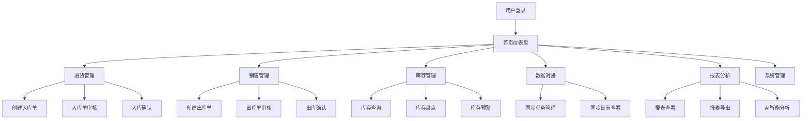

# 需求分析文档

## 1. 项目背景

### 1.1 项目名称
HOF-WMS 仓储管理系统

### 1.2 项目背景
企业仓储管理面临以下痛点：
- 进销存流程依赖人工记录，效率低、易出错
- 库存数据不实时，无法及时预警
- 与外部系统数据孤岛，信息不互通
- 缺乏数据分析能力，决策依赖经验

本项目旨在构建一套数字化仓储管理系统，覆盖进货、销售、库存管理全流程，并通过数据对接和 AI 分析提升运营效率。

### 1.3 项目范围

| 范围 | 说明 |
|------|------|
| 进货管理 | 入库单全生命周期管理 |
| 销售管理 | 出库单全生命周期管理 |
| 库存管理 | 实时库存、盘点、预警 |
| 数据对接 | 外部系统数据同步 |
| 报表分析 | 报表生成、导出、AI 智能分析 |
| 权限管理 | 用户、角色、权限、菜单管理 |

---

## 2. 用户角色分析

### 2.1 角色定义

| 角色 | 职责描述 | 核心操作 |
|------|----------|----------|
| 超级管理员 | 系统全局管理 | 用户管理、角色配置、系统设置 |
| 仓库管理员 | 仓库日常运营管理 | 入库/出库审核、库存盘点、预警处理 |
| 入库员 | 负责入库操作 | 创建入库单、录入商品明细、提交审核 |
| 出库员 | 负责出库操作 | 创建出库单、录入商品明细、提交审核 |
| 审核员 | 负责单据审核 | 审核入库单/出库单 |
| 数据管理员 | 管理数据对接 | 配置同步任务、监控同步状态 |
| 报表查看员 | 查看分析报表 | 查看报表、导出数据、使用 AI 分析 |

### 2.2 用户操作流程图

---

## 3. 功能需求分析

### 3.1 进货管理模块

#### 3.1.1 功能清单

| 功能编号 | 功能名称 | 优先级 | 说明 |
|----------|----------|--------|------|
| F-IN-001 | 入库单创建 | P0 | 录入供应商、仓库、商品明细，保存草稿 |
| F-IN-002 | 入库单编辑 | P0 | 修改草稿状态的入库单 |
| F-IN-003 | 入库单列表查询 | P0 | 按单号、供应商、状态、日期筛选 |
| F-IN-004 | 入库单详情查看 | P0 | 查看入库单完整信息 |
| F-IN-005 | 入库单提交审核 | P0 | 草稿状态提交至待审核 |
| F-IN-006 | 入库单审核 | P0 | 审核通过或驳回 |
| F-IN-007 | 入库确认 | P0 | 审核通过后确认入库，联动库存增加 |
| F-IN-008 | 入库单导出 | P1 | 导出入库单列表为 Excel |
| F-IN-009 | 入库单批量导入 | P2 | 通过 Excel 批量导入入库单 |

#### 3.1.2 业务规则

| 规则编号 | 规则描述 |
|----------|----------|
| R-IN-001 | 入库单号自动生成，格式：IN + 年月日 + 4位流水号 |
| R-IN-002 | 只有草稿状态的入库单可以编辑 |
| R-IN-003 | 提交审核前必须至少包含一条商品明细 |
| R-IN-004 | 审核驳回后回到草稿状态，可重新编辑提交 |
| R-IN-005 | 入库确认后库存实时增加，不可撤销 |
| R-IN-006 | 总金额 = 各明细行数量 x 单价之和 |

### 3.2 销售管理模块

#### 3.2.1 功能清单

| 功能编号 | 功能名称 | 优先级 | 说明 |
|----------|----------|--------|------|
| F-OUT-001 | 出库单创建 | P0 | 录入客户、仓库、商品明细，保存草稿 |
| F-OUT-002 | 出库单编辑 | P0 | 修改草稿状态的出库单 |
| F-OUT-003 | 出库单列表查询 | P0 | 按单号、客户、状态、日期筛选 |
| F-OUT-004 | 出库单详情查看 | P0 | 查看出库单完整信息 |
| F-OUT-005 | 出库单提交审核 | P0 | 草稿状态提交至待审核 |
| F-OUT-006 | 出库单审核 | P0 | 审核通过或驳回 |
| F-OUT-007 | 出库确认 | P0 | 审核通过后确认出库，联动库存扣减 |
| F-OUT-008 | 出库单导出 | P1 | 导出出库单列表为 Excel |

#### 3.2.2 业务规则

| 规则编号 | 规则描述 |
|----------|----------|
| R-OUT-001 | 出库单号自动生成，格式：OUT + 年月日 + 4位流水号 |
| R-OUT-002 | 只有草稿状态的出库单可以编辑 |
| R-OUT-003 | 出库确认前校验可用库存是否充足 |
| R-OUT-004 | 库存不足时拒绝出库并提示具体不足商品 |
| R-OUT-005 | 出库确认后库存实时扣减，不可撤销 |
| R-OUT-006 | 并发出库时通过乐观锁保证库存一致性 |

### 3.3 库存管理模块

#### 3.3.1 功能清单

| 功能编号 | 功能名称 | 优先级 | 说明 |
|----------|----------|--------|------|
| F-INV-001 | 库存查询 | P0 | 按商品、仓库、分类查询当前库存 |
| F-INV-002 | 库存流水查询 | P0 | 查看库存变动明细记录 |
| F-INV-003 | 库存盘点创建 | P0 | 创建盘点单，选择仓库和盘点范围 |
| F-INV-004 | 盘点明细录入 | P0 | 录入实际库存数量，自动计算差异 |
| F-INV-005 | 盘点提交 | P0 | 提交盘点结果，根据差异调整库存 |
| F-INV-006 | 库存预警查询 | P1 | 查看低于安全库存的商品列表 |
| F-INV-007 | 安全库存设置 | P1 | 设置商品的安全库存阈值 |

#### 3.3.2 业务规则

| 规则编号 | 规则描述 |
|----------|----------|
| R-INV-001 | 库存 = 可用库存 + 锁定库存 |
| R-INV-002 | 入库增加可用库存，出库扣减可用库存 |
| R-INV-003 | 每次库存变动必须记录流水 |
| R-INV-004 | 盘点差异 = 实际库存 - 系统库存 |
| R-INV-005 | 盘点提交后按差异自动调整库存并记录流水 |
| R-INV-006 | 可用库存低于安全库存时触发预警 |

### 3.4 数据对接模块

#### 3.4.1 功能清单

| 功能编号 | 功能名称 | 优先级 | 说明 |
|----------|----------|--------|------|
| F-SYNC-001 | 同步任务创建 | P0 | 配置外部系统接口、认证方式、同步类型 |
| F-SYNC-002 | 同步任务编辑 | P0 | 修改同步任务配置 |
| F-SYNC-003 | 字段映射配置 | P0 | 配置源字段到目标字段的映射关系 |
| F-SYNC-004 | 全量同步 | P0 | 全量拉取外部系统数据 |
| F-SYNC-005 | 增量同步 | P0 | 基于时间戳增量拉取变更数据 |
| F-SYNC-006 | 定时同步 | P0 | 按 Cron 表达式定时触发同步 |
| F-SYNC-007 | 手动同步 | P0 | 手动触发一次同步执行 |
| F-SYNC-008 | 测试连接 | P1 | 测试外部系统接口连通性 |
| F-SYNC-009 | 同步日志查询 | P0 | 查看同步执行历史和错误详情 |
| F-SYNC-010 | 任务启用/停用 | P0 | 控制定时任务的启停 |

#### 3.4.2 业务规则

| 规则编号 | 规则描述 |
|----------|----------|
| R-SYNC-001 | 增量同步基于上次同步时间戳提取数据 |
| R-SYNC-002 | 全量同步支持分页拉取，防止内存溢出 |
| R-SYNC-003 | 同步失败记录错误明细，不影响已成功数据 |
| R-SYNC-004 | 定时任务支持 Cron 表达式配置 |
| R-SYNC-005 | 同一任务不允许并发执行 |
| R-SYNC-006 | 字段映射支持固定值、格式转换、枚举映射 |

### 3.5 报表模块

#### 3.5.1 功能清单

| 功能编号 | 功能名称 | 优先级 | 说明 |
|----------|----------|--------|------|
| F-RPT-001 | 入库统计报表 | P0 | 按时间、供应商、商品统计入库数据 |
| F-RPT-002 | 出库统计报表 | P0 | 按时间、客户、商品统计出库数据 |
| F-RPT-003 | 库存统计报表 | P0 | 当前库存汇总、库存周转率 |
| F-RPT-004 | 综合分析报表 | P1 | 进销存综合对比分析 |
| F-RPT-005 | 报表导出 Excel | P0 | 将报表数据导出为 Excel 文件 |
| F-RPT-006 | 报表导出 PDF | P1 | 将报表导出为 PDF 文件 |
| F-RPT-007 | AI 智能分析 | P1 | 对接 AI 大模型进行数据分析 |
| F-RPT-008 | AI 趋势预测 | P2 | 基于历史数据预测库存和销售趋势 |

#### 3.5.2 业务规则

| 规则编号 | 规则描述 |
|----------|----------|
| R-RPT-001 | 大数据量报表异步生成，完成后通知下载 |
| R-RPT-002 | 报表数据写入 Elasticsearch 加速查询 |
| R-RPT-003 | AI 分析结果缓存，相同参数短期内不重复调用 |
| R-RPT-004 | 报表文件保留 30 天后自动清理 |

---

## 4. 非功能需求分析

### 4.1 性能需求

| 指标 | 要求 |
|------|------|
| 页面加载时间 | 首屏 < 3s |
| 接口响应时间 | 普通查询 < 500ms, 复杂查询 < 2s |
| 并发用户数 | 支持 100 并发用户 |
| 报表生成 | 10万行数据报表 < 30s |

### 4.2 可用性需求

| 指标 | 要求 |
|------|------|
| 系统可用率 | 99.5% |
| 数据备份 | 每日自动备份 |
| 故障恢复 | RTO < 4h, RPO < 1h |

### 4.3 安全需求

| 需求 | 说明 |
|------|------|
| 身份认证 | JWT Token 认证，支持 Token 刷新 |
| 权限控制 | RBAC 模型，菜单级 + 按钮级权限 |
| 数据安全 | 密码加密存储，敏感数据脱敏 |
| 操作审计 | 关键操作记录审计日志 |
| 接口安全 | 参数校验、SQL 注入防护、XSS 防护 |

### 4.4 兼容性需求

| 需求 | 说明 |
|------|------|
| 浏览器 | Chrome 90+, Firefox 90+, Edge 90+ |
| 分辨率 | 最低支持 1366x768 |
| 部署环境 | Docker 容器化，支持 Linux 服务器 |

---

## 5. 接口需求分析

### 5.1 外部系统对接接口

| 对接方向 | 协议 | 说明 |
|----------|------|------|
| 拉取外部数据 | HTTP REST | 从外部 ERP/供应链系统拉取数据 |
| 推送数据到外部 | HTTP REST | 预留，后续扩展 |
| AI 大模型调用 | HTTP REST | 调用 AI 大模型 API 进行分析 |

### 5.2 认证方式支持

| 认证方式 | 说明 |
|----------|------|
| API Key | 请求头携带 API Key |
| Basic Auth | 用户名密码认证 |
| OAuth 2.0 | Token 认证 |
| 自定义签名 | 自定义签名算法 |

---

## 6. 数据需求分析

### 6.1 数据量预估

| 数据类型 | 日增量 | 年增量 |
|----------|--------|--------|
| 入库单 | 50-100 | 2-4万 |
| 出库单 | 100-200 | 4-8万 |
| 库存流水 | 500-1000 | 20-40万 |
| 同步日志 | 100-500 | 4-20万 |
| 报表文件 | 10-20 | 4000-8000 |

### 6.2 数据保留策略

| 数据类型 | 保留策略 |
|----------|----------|
| 业务单据 | 永久保留 |
| 库存流水 | 永久保留 |
| 同步日志 | 保留 1 年 |
| 报表文件 | 保留 30 天 |
| 操作审计日志 | 保留 2 年 |

---

## 7. 验收标准

### 7.1 功能验收

| 模块 | 验收标准 |
|------|----------|
| 进货管理 | 入库单全流程可正常操作，库存联动正确 |
| 销售管理 | 出库单全流程可正常操作，库存扣减正确 |
| 库存管理 | 库存查询实时准确，盘点差异计算正确，预警触发正常 |
| 数据对接 | 增量/全量同步正常，定时/手动触发正常，日志记录完整 |
| 报表分析 | 报表数据准确，导出文件可正常打开，AI 分析返回结果 |
| 权限管理 | 不同角色看到不同菜单，无权限操作被拦截 |

### 7.2 非功能验收

| 项目 | 验收标准 |
|------|----------|
| 性能 | 接口响应时间满足 4.1 要求 |
| 安全 | 通过基本安全测试，无 SQL 注入、XSS 漏洞 |
| 部署 | docker-compose up 一键启动所有服务 |
| 文档 | 提供部署文档和用户操作手册 |
