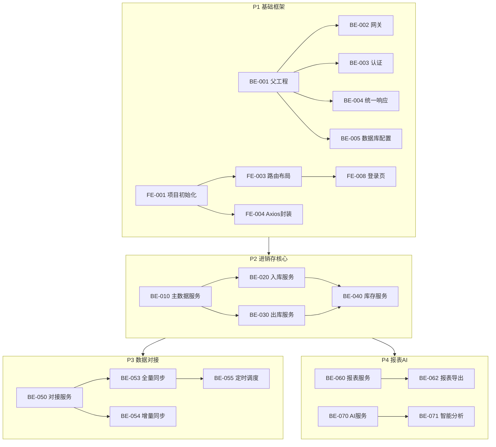

# 任务分解文档

本文档将项目拆解为前端、后端、测试三个角色的具体任务，按模块和优先级排列。

---

## 阶段总览

---

## P1 - 基础框架搭建

### 后端任务

| 编号 | 任务 | 说明 |
|------|------|------|
| BE-001 | 创建父工程和公共模块 | 搭建 Gradle 多模块工程, 创建 common-core, common-db, common-web |
| BE-002 | 搭建 gateway-service | Spring Cloud Gateway 配置, 路由转发, 统一鉴权过滤器 |
| BE-003 | 搭建 auth-service | JWT 登录认证, Token 签发与刷新, 用户表设计 |
| BE-004 | 统一响应封装 | ApiResult, PageResult, 全局异常处理器, 参数校验 |
| BE-005 | 数据库基础配置 | PostgreSQL 连接, MyBatis-Plus 配置, 逻辑删除, 自动填充 |
| BE-006 | Redis 基础配置 | Redis 连接池, 缓存工具类, 分布式锁工具 |
| BE-007 | Docker 基础环境 | docker-compose 编排 PostgreSQL, Redis, Elasticsearch |

### 前端任务

| 编号 | 任务 | 说明 |
|------|------|------|
| FE-001 | 初始化 Vue3 + Vite 项目 | 项目脚手架, TypeScript 配置, ESLint, Prettier |
| FE-002 | Element Plus 集成 | 按需引入, 主题定制, 国际化配置 |
| FE-003 | 路由与布局搭建 | Vue Router 配置, DefaultLayout 布局组件, 侧边菜单 |
| FE-004 | Axios 封装 | 请求/响应拦截器, Token 携带, 错误统一处理 |
| FE-005 | Pinia 状态管理 | Store 基础结构, 用户状态管理 |
| FE-006 | 公共组件开发 - TablePro | 通用表格组件, 支持分页/搜索/操作列 |
| FE-007 | 公共组件开发 - FormPro | 通用表单组件, 支持校验/布局配置 |
| FE-008 | 登录页面 | 登录表单, Token 存储, 登录跳转 |

### 测试任务

| 编号 | 任务 | 说明 |
|------|------|------|
| QA-001 | 搭建测试框架 | JUnit 5 + Mockito 配置, 测试基类编写 |
| QA-002 | 编写 auth-service 单元测试 | 登录、Token 签发、Token 校验测试用例 |
| QA-003 | 编写登录功能测试用例 | 登录成功、失败、Token 过期等场景 |

---

## P2 - 主数据 + 进销存核心

### 后端任务

| 编号 | 任务 | 说明 |
|------|------|------|
| BE-010 | master-data-service 搭建 | 商品、仓库、供应商、客户 CRUD 接口 |
| BE-011 | 商品管理接口 | 商品新增、编辑、查询、分页、状态变更 |
| BE-012 | 仓库管理接口 | 仓库新增、编辑、查询 |
| BE-013 | 供应商管理接口 | 供应商新增、编辑、查询 |
| BE-014 | 客户管理接口 | 客户新增、编辑、查询 |
| BE-020 | inbound-service 搭建 | 入库单 CRUD, 状态机实现 |
| BE-021 | 入库单创建与编辑 | 入库单主表+明细表保存, 金额计算 |
| BE-022 | 入库审核流程 | 提交、审核通过、审核驳回接口 |
| BE-023 | 入库确认与库存联动 | 确认入库, 调用库存服务增加库存, 事务保证 |
| BE-030 | outbound-service 搭建 | 出库单 CRUD, 状态机实现 |
| BE-031 | 出库单创建与编辑 | 出库单主表+明细表保存, 金额计算 |
| BE-032 | 出库审核流程 | 提交、审核通过、审核驳回接口 |
| BE-033 | 出库确认与库存联动 | 确认出库, 库存校验, 扣减库存, 事务保证 |
| BE-040 | inventory-service 搭建 | 库存查询, 库存流水记录 |
| BE-041 | 库存增减接口 | 入库增加、出库扣减, 乐观锁控制 |
| BE-042 | 库存盘点功能 | 盘点单创建、盘点明细录入、盘点提交、差异处理 |
| BE-043 | 库存预警功能 | 安全库存设置, 预警查询接口 |

### 前端任务

| 编号 | 任务 | 说明 |
|------|------|------|
| FE-010 | 商品管理页面 | 商品列表、新增/编辑弹窗 |
| FE-011 | 仓库管理页面 | 仓库列表、新增/编辑弹窗 |
| FE-012 | 供应商管理页面 | 供应商列表、新增/编辑弹窗 |
| FE-013 | 客户管理页面 | 客户列表、新增/编辑弹窗 |
| FE-020 | 入库单列表页 | 搜索、分页、状态筛选、操作按钮 |
| FE-021 | 入库单详情/编辑页 | 基本信息表单 + 商品明细可编辑表格 |
| FE-022 | 入库审核操作 | 提交、审核通过、审核驳回按钮与确认弹窗 |
| FE-030 | 出库单列表页 | 搜索、分页、状态筛选、操作按钮 |
| FE-031 | 出库单详情/编辑页 | 基本信息表单 + 商品明细可编辑表格 |
| FE-032 | 出库审核操作 | 提交、审核通过、审核驳回按钮与确认弹窗 |
| FE-040 | 库存查询页 | 库存列表、搜索、分页 |
| FE-041 | 库存盘点页 | 盘点单创建、明细录入、差异展示 |
| FE-042 | 库存预警页 | 预警列表、安全库存设置弹窗 |

### 测试任务

| 编号 | 任务 | 说明 |
|------|------|------|
| QA-010 | 主数据 CRUD 测试 | 商品、仓库、供应商、客户增删改查测试 |
| QA-020 | 入库单全流程测试 | 创建-提交-审核-入库确认全链路 |
| QA-021 | 入库库存联动测试 | 入库后库存数量正确增加 |
| QA-030 | 出库单全流程测试 | 创建-提交-审核-出库确认全链路 |
| QA-031 | 出库库存校验测试 | 库存不足时出库拒绝 |
| QA-032 | 并发出库测试 | 多个出库单同时扣减同一商品库存 |
| QA-040 | 库存盘点测试 | 盘点差异计算正确性 |
| QA-041 | 库存预警测试 | 低于安全库存时预警触发 |

---

## P3 - 数据对接模块

### 后端任务

| 编号 | 任务 | 说明 |
|------|------|------|
| BE-050 | integration-service 搭建 | 服务基础框架, 数据库表创建 |
| BE-051 | 同步任务管理接口 | 任务 CRUD, 启用/停用 |
| BE-052 | 字段映射配置 | 字段映射 CRUD, 转换规则引擎 |
| BE-053 | 全量同步实现 | 分页拉取外部数据, 批量写入, 断点续传 |
| BE-054 | 增量同步实现 | 基于时间戳增量拉取, 更新/新增判断 |
| BE-055 | 定时调度实现 | Cron 表达式解析, 定时任务注册与管理 |
| BE-056 | 手动执行与测试连接 | 手动触发同步, 外部接口连通性测试 |
| BE-057 | 同步日志记录 | 执行日志写入, 成功/失败统计, 错误明细 |

### 前端任务

| 编号 | 任务 | 说明 |
|------|------|------|
| FE-050 | 同步任务列表页 | 任务列表、状态展示、操作按钮 |
| FE-051 | 同步任务配置页 | 基本信息、同步配置、字段映射表格 |
| FE-052 | 测试连接与手动执行 | 测试连接按钮、手动执行按钮、执行状态反馈 |
| FE-053 | 同步日志页 | 日志列表、状态筛选、错误详情查看 |

### 测试任务

| 编号 | 任务 | 说明 |
|------|------|------|
| QA-050 | 全量同步测试 | 全量拉取数据写入正确 |
| QA-051 | 增量同步测试 | 增量数据正确识别和写入 |
| QA-052 | 定时调度测试 | Cron 表达式触发正确 |
| QA-053 | 同步异常测试 | 外部接口超时、数据格式错误等异常场景 |
| QA-054 | 同步日志测试 | 日志记录完整性和准确性 |

---

## P4 - 报表与 AI 模块

### 后端任务

| 编号 | 任务 | 说明 |
|------|------|------|
| BE-060 | report-service 搭建 | 服务基础框架 |
| BE-061 | 报表汇总查询 | 入库/出库/库存统计汇总接口 |
| BE-062 | 报表生成与导出 | 异步生成 Excel/PDF, 文件存储, 下载接口 |
| BE-063 | Elasticsearch 报表索引 | 报表数据写入 ES, 复杂查询加速 |
| BE-070 | ai-service 搭建 | AI 服务基础框架 |
| BE-071 | AI 智能分析接口 | 对接 AI 大模型, 传入业务数据, 返回分析结果 |
| BE-072 | 趋势预测接口 | 基于历史数据的库存/销售趋势预测 |

### 前端任务

| 编号 | 任务 | 说明 |
|------|------|------|
| FE-060 | 报表中心页 | 报表分类 Tabs, 报表卡片入口 |
| FE-061 | 报表详情页 | 筛选条件、ECharts 图表、数据表格 |
| FE-062 | 报表导出功能 | 导出 Excel/PDF 按钮, 下载进度提示 |
| FE-070 | AI 智能分析页 | 对话面板、分析结果展示 |
| FE-071 | 预测图表组件 | 趋势预测折线图, 预测区间展示 |

### 测试任务

| 编号 | 任务 | 说明 |
|------|------|------|
| QA-060 | 报表数据准确性测试 | 汇总数据与明细数据一致性 |
| QA-061 | 报表导出测试 | Excel/PDF 文件可正常打开, 数据完整 |
| QA-062 | AI 分析接口测试 | AI 接口调用成功, 返回结果格式正确 |
| QA-063 | 预测功能测试 | 预测结果合理性验证 |

---

## P5 - 联调、优化与部署

### 后端任务

| 编号 | 任务 | 说明 |
|------|------|------|
| BE-080 | 前后端联调 | 配合前端联调所有接口 |
| BE-081 | 性能优化 | 慢 SQL 优化, 缓存策略调优, 接口响应优化 |
| BE-082 | Dockerfile 编写 | 各服务 Dockerfile, 多阶段构建 |
| BE-083 | docker-compose 编排 | 全服务编排, 环境变量配置, 健康检查 |
| BE-084 | 生产环境配置 | 生产 profile 配置, 日志级别, 连接池参数 |

### 前端任务

| 编号 | 任务 | 说明 |
|------|------|------|
| FE-080 | 前后端联调 | 对接所有后端接口, 修复联调问题 |
| FE-081 | UI 优化与适配 | 响应式适配, 交互细节优化 |
| FE-082 | 构建与部署 | Vite 生产构建, Nginx 配置, Docker 镜像 |

### 测试任务

| 编号 | 任务 | 说明 |
|------|------|------|
| QA-080 | 端到端集成测试 | 全流程端到端测试 |
| QA-081 | 性能测试 | 接口响应时间, 并发压力测试 |
| QA-082 | 回归测试 | 全模块回归测试 |

---

## 任务依赖关系

---

## 任务统计

| 角色 | P1 | P2 | P3 | P4 | P5 | 合计 |
|------|----|----|----|----|-----|------|
| 后端 | 7 | 14 | 8 | 7 | 5 | 41 |
| 前端 | 8 | 13 | 4 | 5 | 3 | 33 |
| 测试 | 3 | 8 | 5 | 4 | 3 | 23 |
| 合计 | 18 | 35 | 17 | 16 | 11 | 97 |
